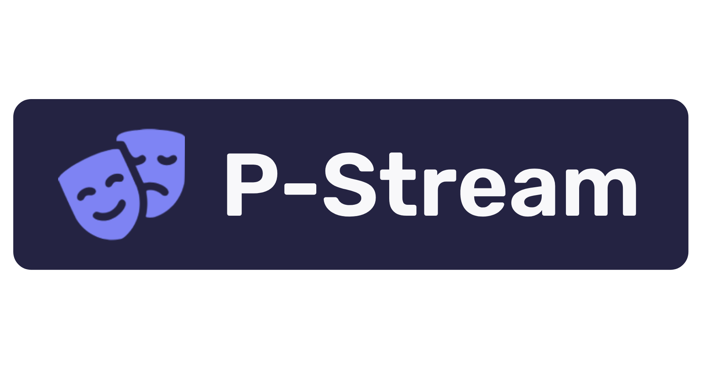

# P-Stream

<p align="center">
  
</p>

<p align="center">
  A free, open-source streaming platform for movies and TV shows. Watch your favorite content without ads, completely free and open source!
</p>

<p align="center">
  <a href="https://github.com/p-stream/p-stream/stargazers">
    
  </a>
  <a href="https://github.com/p-stream/p-stream/issues">
    
  </a>
  <a href="LICENSE.md">
    
  </a>
</p>

---

## ⚡ Quick Start

### For Web App (Recommended)

```bash
# Linux
./scripts/linux/install-web.sh

# Windows
scripts\windows\install-web.bat

# Mac
./scripts/mac/install-web.sh
```

### For Desktop App

```bash
# Linux
./scripts/linux/install-app.sh

# Windows
scripts\windows\install-app.bat

# Mac
./scripts/mac/install-app.sh
```

That's it! Open **http://localhost** in your browser!

---

## ✨ Features

- 🎬 **Movies & TV Shows** - Stream your favorite content
- 🚫 **No Ads** - Completely ad-free experience
- 👤 **User Accounts** - Sign up to sync watch history across devices
- 📚 **Watch History** - Resume watching where you left off
- 🔖 **Bookmarks** - Save your favorite shows and movies
- 🔄 **Multiple Sources** - Streams from various providers
- 🚀 **Self-hostable** - Run your own instance
- 📱 **Mobile Support** - Works on phones and tablets
- 🖥️ **Desktop App** - Native Electron app for Linux, Windows, macOS

---

## 🏗️ Architecture

| Service         | Port                  | Description                                  |
| --------------- | --------------------- | -------------------------------------------- |
| **Web App**     | http://localhost      | Main streaming interface (React + Vite)      |
| **Backend API** | http://localhost:3001 | User accounts, authentication, watch history |
| **Proxy**       | http://localhost:3000 | CORS proxy for streaming providers           |
| **Database**    | localhost:5432        | PostgreSQL for user data                     |

---

## 🛠️ Tech Stack

- **Frontend:** React, TypeScript, Vite, Tailwind CSS
- **Backend:** Node.js, Hono, Prisma
- **Database:** PostgreSQL
- **Proxy:** Nitro (UnJS)
- **Desktop:** Electron
- **Container:** Docker, Docker Compose

---

## 📖 Documentation

For detailed setup instructions, see [SETUP-GUIDE.md](./SETUP-GUIDE.md).

### Manual Docker Setup

```bash
# Clone the repository
git clone https://github.com/p-stream/p-stream.git
cd p-stream

# Start all services
docker compose up --build -d

# Access at http://localhost
```

### Development Setup

```bash
# Install dependencies
pnpm install

# Run in development mode
pnpm run dev
```

---

## 📦 Components

| Component       | Description                    | Location            |
| --------------- | ------------------------------ | ------------------- |
| **Web App**     | Main streaming web application | Root directory      |
| **Desktop App** | Electron desktop application   | `p-stream-desktop/` |
| **Backend**     | API server for user accounts   | `backend/`          |
| **Proxy**       | CORS proxy for streaming       | `simple-proxy/`     |
| **Providers**   | Streaming source scrapers      | `providers/`        |

---

## 🤝 Contributing

Contributions are welcome! Please read our [contributing guidelines](.github/CONTRIBUTING.md) first.

---

## 📝 License

This project is licensed under the [MIT License](LICENSE.md).

---

## ⚠️ Disclaimer

P-Stream is an open-source project for educational purposes. The maintainers do not host or provide any streaming content. Users are responsible for ensuring they have the right to access content in their jurisdiction.

---

<p align="center">
  Made with ❤️ by the P-Stream community
</p>
